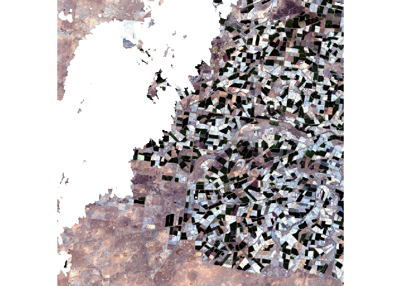
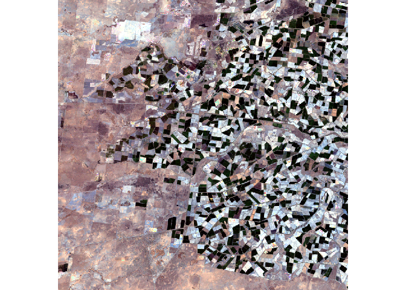

<!-- README.md is generated from README.Rmd. Please edit that file -->

# cloudfil

<!-- badges: start -->
<!-- badges: end -->

The goal of `cloudfil` is to fill the gaps in satellite images caused by
clouds.

# Installation

The package can be installed from Github as follows:

``` r
library("devtools")
install_github("mmontesinosanmartin/cloudfil")
```

# Example

This is a basic example that shows how to fill the gaps from a satellite
image left by clouds. In addition to the cloudy image, the algorithm
requires a clear-sky image. This clear-sky image works as a reference.

``` r
library(cloudfil)
#> Loading required package: raster
#> Loading required package: sp
#> Loading required package: Rcpp
#> Loading required package: RcppArmadillo
data("clr.img")
data("cld.img")
plotRGB(cld.img, stretch = "lin")
```

<!-- -->

``` r
fill.img <- fill_stack(clr.img, cld.img, w = 10)
plotRGB(fill.img, stretch = "lin")
```

<!-- -->
