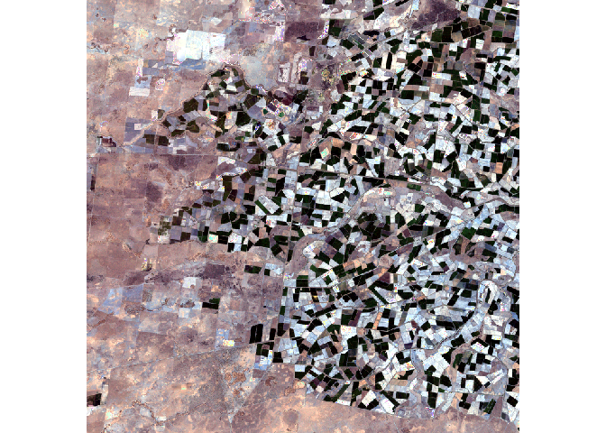

<!-- README.md is generated from README.Rmd. Please edit that file -->

# cloudfil

<!-- badges: start -->
<!-- badges: end -->

The goal of `cloudfil` is to fill the gaps in satellite images caused by
clouds.

# Installation

The package can be installed from Github as follows:

``` r
library("devtools")
install_github("mmontesinosanmartin/cloudfil")
```

# Example

This is an example on how to fill gaps in satellite images left by
clouds. The technique requires the cloudy image and a clear-sky image
from the same location on another date.

``` r
library(cloudfil)
#> Loading required package: raster
#> Loading required package: sp
#> Loading required package: Rcpp
#> Loading required package: RcppArmadillo
data("clr.img")
data("cld.img")
plotRGB(cld.img, stretch = "lin")
```

<!-- -->

Apply the `fill_stack()` function to fill the `cld.img` based on the
`clr.img`. Define a neighborhood of size (2w+1)x(2w+1) around every
missing pixel. The information in the neighboring area is used to fill
the missing value.

``` r
fill.img <- fill_stack(clr.img, cld.img, w = 10)
plotRGB(fill.img, stretch = "lin")
```

<!-- -->

Let’s test the prediction against the actual image:

``` r
data("trg.img")
eval_rmse(fill.img, trg.img)
#>            [,1]
#> [1,] 0.01727819
```
